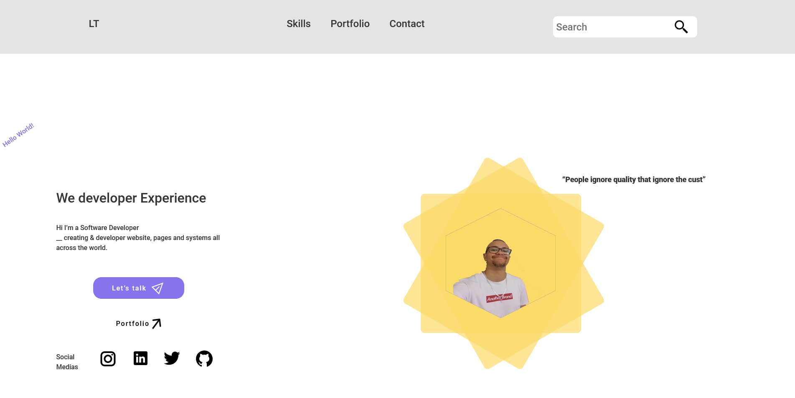
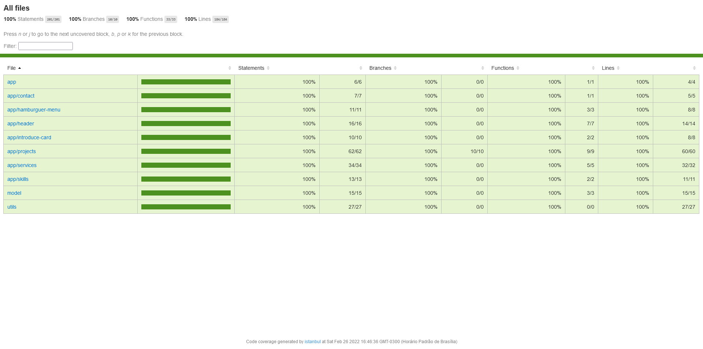

 
# My Personal Webpage.

(I am not fluent in english so, sorry for the mistakes in some text, thanks for the compression)

This project was made, to prove my skills in angular and frontend, most part of things I will done here, i go lerning in the process. I learning so much abou responsive layouts, css, flexbox, gridlayout, components, binding and lot things. The tests don't was made but this is not the focus, in future a pretend made coverage and better him but not for now.

If you want acess this is the [link!](https://luccastraumer.github.io/) 

In Desktop:

In Mobile:

That is the coverage of the project:

